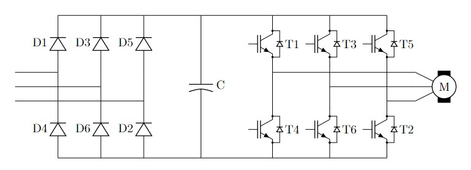

# Fault detection in a three-phase inverter with artificial intelligence.

## About
Power Electronics technology has been evolving in the last five decades with applications spread through the industrial, commercial and residential environments. Nowadays, some of the targeted applications include special requirements to guarantee a higher standard of reliability of the device. For instance, the energy sector, aviation, and aerospace, just to name a few. Among all the possibilities to increase the reliability of these systems, this work studies condition monitoring techniques for power converters, especially to detect faults and recognize abnormal conditions. 

Power converters, like all Power Electronic devices, are used to process and control the flow of energy and to supply the optimal currents and voltages to the load. The nature of this task demands lower energy losses as much as possible due to energy costs and the difficulty of removing the produced heat by losses. These demands have been fulfilled by the advances in semiconductor technology to create electronic switches that can operate intermittently. Such components reproduce current and voltage patterns by opening and closing at high frequencies, resulting in inferior losses than linear electronic circuits.

When converters are applied to systems with high-reliability standards, such as a wind generator or a huge solar power plant they require, among other things, that the devices can endure the applications' conditions to a point where maintenance needs are predictable to meet cost and efficiency purposes. One of the ways that are receiving the attention of the research community is the condition monitoring of those devices. 

Condition monitoring is better defined by [S. Yang](https://ieeexplore.ieee.org/abstract/document/5457999) as a real-time measurement of a component or a system and taking appropriate actions with the collected information. This project investigates the recent works on this subject with algorithms that require available signals for control purposes such as stator currents and voltages. The algorithms are investigated with simulations of an induction motor-drive system. The circuit topology of the system is shown in the figure below.

| |
|:-:|
| Inverter-drive topology adopted in this work: two-level three-phase inverter with 6 switches named T1 to T6.|

The first case is to analyze motor drives under scalar control. So, the experience is conducted with a simulation in Simulink and the signals are processed with Python afterward. The analyses involve the detection of fault states and open and short-circuit the switches T1 to T6. Once a fault-detection is established, the experience focuses on the detection of abnormal states in which:
1. The switch cannot be triggered properly;
2. There is a degradation of the switch so the opening or closing cannot be executed properly.
Hence machine learning and signal processing tools are used.

The same experience is repeated with vector control and direct torque control.

## Project's folders.
* Dissertation - includes the Latex document and dependencies.
* figures - include the selected figures of the project.
* source - has all the simulation and signal processing files.
* source/images - has all the saved images of the analysis.
* source/Simulations - has all the simulations.
* source/tools - has all the tools to process the signal.

